# Домашнее задание к занятию "`Что такое DevOps. CI/CD`" - `Суханов Олег`


# Задание 1. Freestyle Project для сборки Go-проекта и Docker-образа

## Содержание

1. [Цель работы](#цель-работы)
2. [Задание](#задание)
3. [Используемое окружение](#используемое-окружение)
4. [Ход выполнения](#ход-выполнения)
   - [1. Создание виртуальной машины в Yandex Cloud](#1-создание-виртуальной-машины-в-yandex-cloud)
   - [2. Установка Java 21](#2-установка-java-21)
   - [3. Установка Jenkins](#3-установка-jenkins)
   - [4. Первичная настройка Jenkins](#4-первичная-настройка-jenkins)
   - [5. Установка Go](#5-установка-go)
   - [6. Установка Docker](#6-установка-docker)
   - [7. Форк репозитория на GitHub](#7-форк-репозитория-на-github)
   - [8. Создание Freestyle Project в Jenkins](#8-создание-freestyle-project-в-jenkins)
   - [9. Запуск сборки и результаты](#9-запуск-сборки-и-результаты)
5. [Проверка результата](#проверка-результата)
6. [Скриншоты](#скриншоты)
7. [Возникшие проблемы и их решение](#возникшие-проблемы-и-их-решение)
8. [Выводы](#выводы)

---

## Цель работы

Освоить установку и базовую настройку Jenkins, получить практические навыки
работы с Freestyle Project, интеграции Jenkins с GitHub, запуска тестов Go
и сборки Docker-образа в рамках CI-пайплайна.

## Задание

1. Установить Jenkins (без использования Docker).
2. Установить Go на машину с Jenkins.
3. Сделать форк репозитория с материалами задания на GitHub.
4. Создать в Jenkins **Freestyle Project**, подключить к нему репозиторий
   и выполнить запуск:
   - тестов: `go test .`
   - сборки образа: `docker build .`

## Используемое окружение

| Параметр | Значение |
|---|---|
| Платформа | Yandex Cloud |
| ОС | Ubuntu 20.04 LTS (focal) |
| Виртуальная машина | `jenkins-server` |
| Публичный IP | `93.77.164.8` |
| Java | OpenJDK 21.0.7 |
| Jenkins | 2.4xx (LTS) |
| Go | 1.25.8 linux/amd64 |
| Docker | 26.1.3 |
| Git | 2.25.1 |
| Репозиторий | `https://github.com/sykhanovov-png/sdvps-materials-CICD` |

## Ход выполнения

### 1. Создание виртуальной машины в Yandex Cloud

ВМ создана в консоли Yandex Cloud:

- Образ: **Ubuntu 20.04 LTS**
- 2 vCPU, 4 ГБ RAM, 25 ГБ SSD
- Публичный IP присвоен (используется для доступа к Jenkins)
- В **security group** открыт входящий TCP-порт **8080** для веб-интерфейса Jenkins

Подключение к ВМ по SSH:

```bash
ssh ubuntu@93.77.164.8
```

### 2. Установка Java 21

Jenkins требует Java 21+. Выполнено:

```bash
sudo apt update
sudo apt install -y fontconfig openjdk-21-jre
java -version
```

Вывод подтверждает установку OpenJDK 21.0.7:

```
openjdk version "21.0.7" 2025-04-15
OpenJDK Runtime Environment (build 21.0.7+6-Ubuntu-0ubuntu120.04)
OpenJDK 64-Bit Server VM (build 21.0.7+6-Ubuntu-0ubuntu120.04, mixed mode, sharing)
```

### 3. Установка Jenkins

Добавлен актуальный APT-ключ и репозиторий Jenkins:

```bash
sudo mkdir -p /etc/apt/keyrings

sudo wget -O /etc/apt/keyrings/jenkins-keyring.asc \
  https://pkg.jenkins.io/debian-stable/jenkins.io-2026.key

echo 'deb [signed-by=/etc/apt/keyrings/jenkins-keyring.asc] https://pkg.jenkins.io/debian-stable binary/' \
  | sudo tee /etc/apt/sources.list.d/jenkins.list

sudo apt update
sudo apt install -y jenkins

sudo systemctl start jenkins
sudo systemctl enable jenkins
sudo systemctl status jenkins
```

Служба запущена и добавлена в автозагрузку. Jenkins слушает порт **8080**.

Получение начального пароля:

```bash
sudo cat /var/lib/jenkins/secrets/initialAdminPassword
```

### 4. Первичная настройка Jenkins

- Веб-интерфейс открыт по адресу `http://93.77.164.8:8080`
- Введён начальный пароль, нажата кнопка **Install suggested plugins**
- Дождались установки плагинов (3–5 минут)
- Создан администратор (логин, пароль, email)
- Нажата кнопка **Start using Jenkins**

Дополнительно установлены плагины:

1. **Manage Jenkins** → **Plugins** → **Available plugins**
2. Найдены и отмечены:
   - **Git plugin**
   - **Docker Pipeline**
3. Нажата кнопка **Install**
4. Дождались завершения установки

### 5. Установка Go

Go установлен через PPA `longsleep/golang-backports`:

```bash
sudo add-apt-repository ppa:longsleep/golang-backports -y
sudo apt update
sudo apt install -y golang-go
go version
```

Вывод:

```
go version go1.25.8 linux/amd64
```

Проверено, что Go доступен пользователю `jenkins`:

```bash
sudo -u jenkins bash -c 'which go && go version'
```

Вывод:

```
/usr/bin/go
go version go1.25.8 linux/amd64
```

Поскольку Go установлен системно через PPA, дополнительные настройки `PATH`
не требуются.

### 6. Установка Docker

Docker установлен из системного репозитория Ubuntu:

```bash
sudo apt install -y docker.io
sudo systemctl start docker
sudo systemctl enable docker
```

Пользователь `jenkins` добавлен в группу `docker`, чтобы сборка могла
запускать Docker без `sudo`:

```bash
sudo usermod -aG docker jenkins
sudo systemctl restart jenkins
```

Проверка от имени jenkins:

```bash
sudo -u jenkins docker version
```

Вывод подтверждает работоспособность:

```
Client:
 Version:           26.1.3
 API version:       1.45
 ...

Server:
 Engine:
  Version:          26.1.3
  API version:      1.45 (minimum version 1.24)
  ...
```

### 7. Форк репозитория на GitHub

Исходный репозиторий с материалами задания:

```
https://github.com/netology-code/sdvps-materials
```

Сделан форк в личный аккаунт GitHub. Итоговый URL, используемый в Jenkins:

```
https://github.com/sykhanovov-png/sdvps-materials-CICD.git
```

Структура репозитория:

| Файл | Назначение |
|---|---|
| `go.mod` | описание Go-модуля |
| `main.go` | исходный код приложения |
| `main_test.go` | unit-тесты |
| `Dockerfile` | инструкции сборки Docker-образа |
| `README.md` | описание проекта |
| `Vagrantfile` | конфигурация Vagrant (вспомогательное) |

Ветка по умолчанию: **`main`**.

### 8. Создание Freestyle Project в Jenkins

Создан проект **Freestyle project** с именем `test-CICD`.

**Шаги создания:**

1. На главной странице Jenkins — **New Item** (Новый Item).
2. Имя: `test-CICD`.
3. Тип: **Freestyle project** (в русской локали — «Создать задачу со свободной
   конфигурацией»).
4. **OK**.

**Раздел «Общие настройки»:**

- Описание: `Сборка Go-проекта и Docker-образа (ДЗ по CICD)`
- Остальные галочки оставлены по умолчанию.

**Раздел «Управление исходным кодом»:**

- Тип: **Git**
- Repository URL: `https://github.com/sykhanovov-png/sdvps-materials-CICD.git`
- Credentials: `- none -` (публичный репозиторий)
- Branch Specifier: `*/main`

**Раздел «Triggers»:** оставлен пустым (сборка вручную).

**Раздел «Environment»:** оставлен пустым.

**Раздел «Шаги сборки»** — добавлен шаг `Execute shell`
(Выполнить shell) со следующим скриптом:

```bash
#!/bin/bash
set -e

echo "=== Workspace: $(pwd) ==="
ls -la

echo "=== Go version ==="
go version

echo "=== Running go test ==="
go test .

echo "=== Building Docker image ==="
docker build -t sdvps-go-app:latest .

echo "=== SUCCESS ==="
```

Ключевые элементы скрипта:

- `set -e` — прерывает сборку при первой ошибке (чтобы `docker build` не
  запускался, если тесты упали)
- `go test .` — запускает unit-тесты текущего пакета
- `docker build -t sdvps-go-app:latest .` — собирает образ по `Dockerfile`
  в корне репозитория
- `echo "=== SUCCESS ==="` — маркер успешного завершения

**Раздел «Последборочные операции»:** оставлен пустым.

Нажата кнопка **Save**.

### 9. Запуск сборки и результаты

Запуск сборки: на странице проекта нажата кнопка **Build Now**
(Запустить сборку) → сборка `#1`.

Ключевые фрагменты **Console Output**:

```
Started by user Олег
Running as SYSTEM
Building in workspace /var/lib/jenkins/workspace/test-CICD
Cloning repository https://github.com/sykhanovov-png/sdvps-materials-CICD.git
Checking out Revision 223dbc3f489784448004e020f2ef224f17a7b06d (refs/remotes/origin/main)
Commit message: "Update README.md"
First time build. Skipping changelog.
[test-CICD] $ /bin/bash /tmp/jenkins9953634221424216782.sh
=== Workspace: /var/lib/jenkins/workspace/test-CICD ===
...
=== Go version ===
go version go1.25.8 linux/amd64
=== Running go test ===
ok  	github.com/netology-code/sdvps-materials	0.002s
=== Building Docker image ===
Step 1/8 : FROM golang:1.16 AS builder
...
Step 8/8 : CMD ["/app"]
Successfully built 723299fbdcb6
Successfully tagged sdvps-go-app:latest
=== SUCCESS ===
Finished: SUCCESS
```

**Итог:**

- ✅ репозиторий успешно клонирован (ветка `main`, коммит `223dbc3`)
- ✅ `go test .` — тесты прошли (`ok ... 0.002s`)
- ✅ `docker build .` — образ `sdvps-go-app:latest` собран
- ✅ сборка завершена со статусом **SUCCESS**

## Проверка результата

На ВМ подтверждено, что Docker-образ существует:

```bash
sudo docker images | grep sdvps-go-app
```

Вывод:

```
sdvps-go-app   latest   723299fbdcb6   ...   ...
```

## Скриншоты

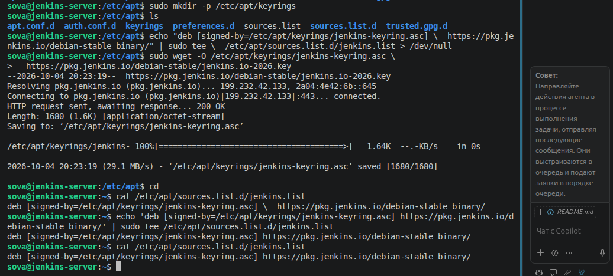
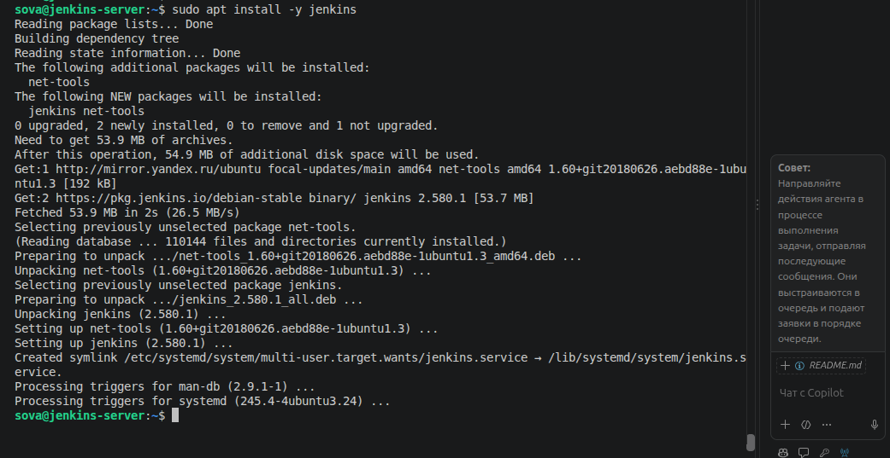
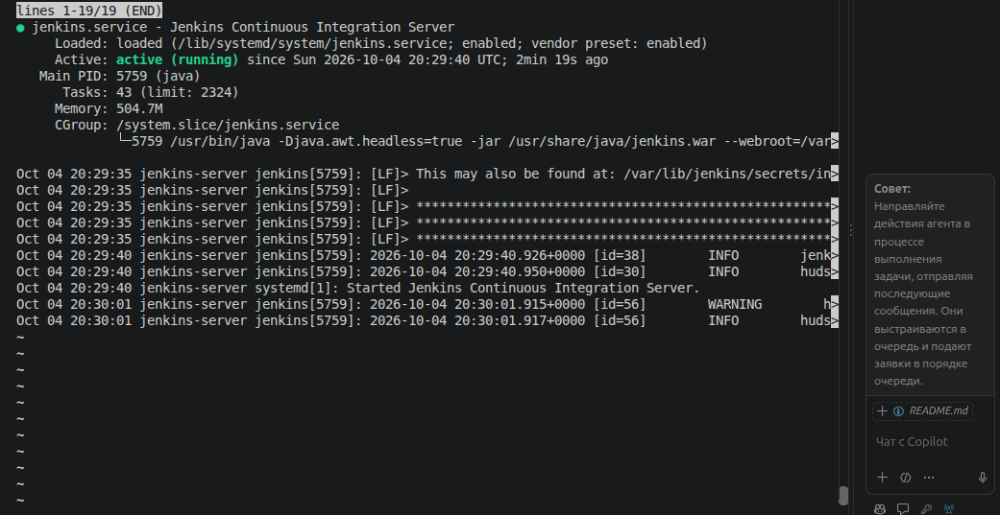
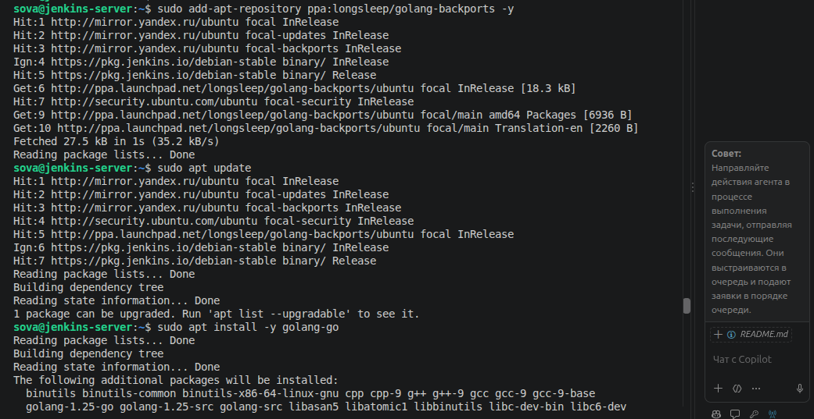
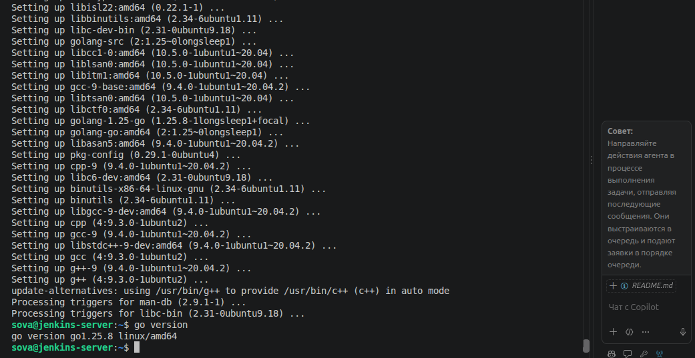
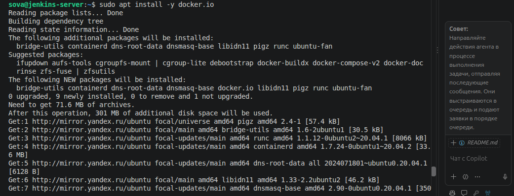
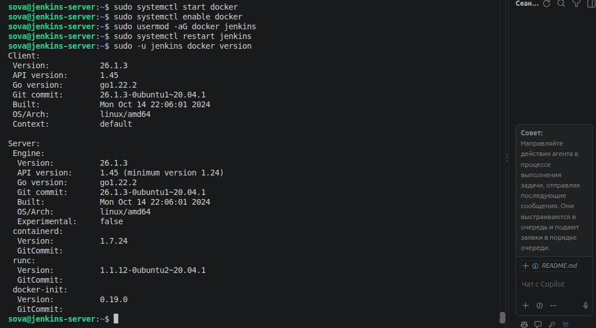
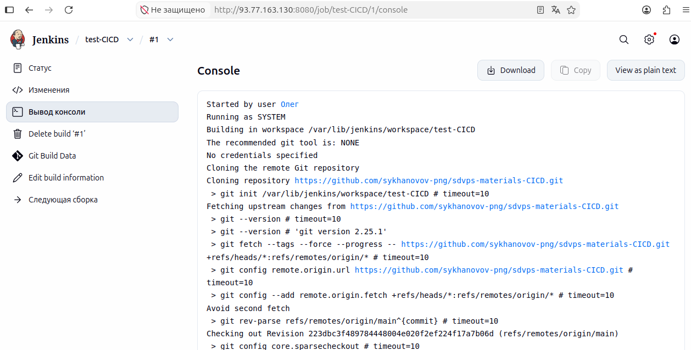
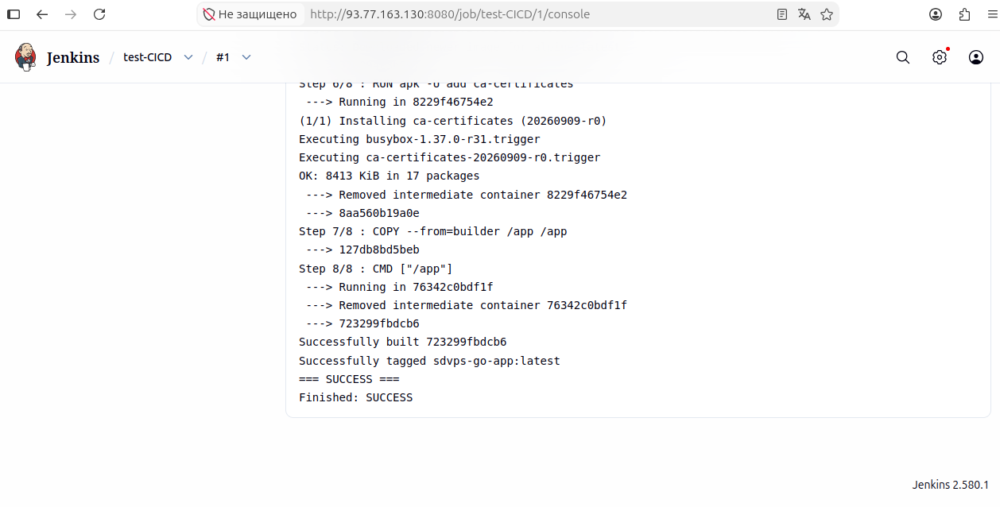
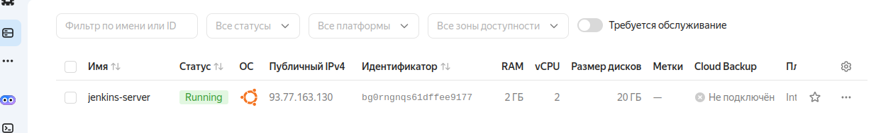
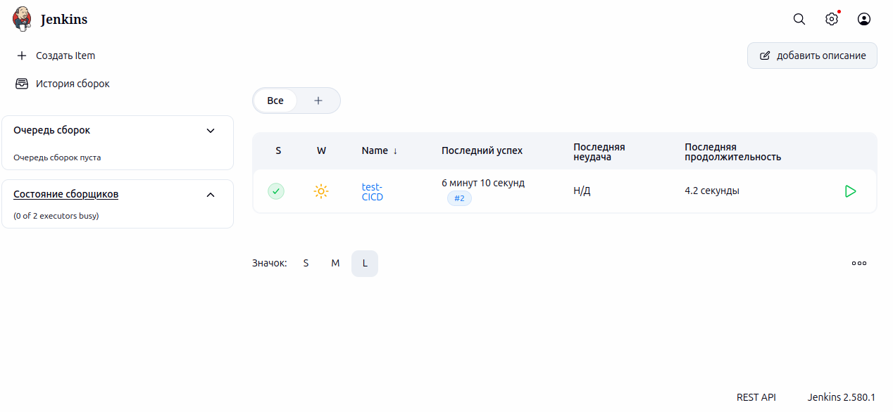
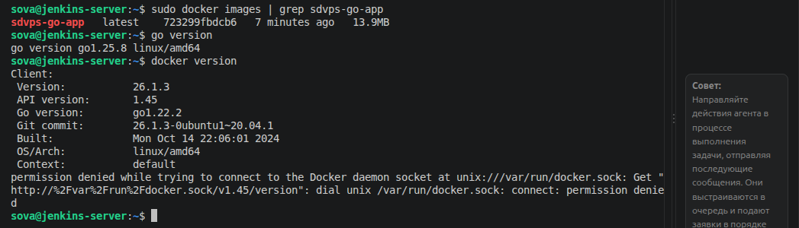

# Задание 2. Declarative Pipeline

## Содержание

1. [Цель работы](#цель-работы)
2. [Что требуется по заданию](#что-требуется-по-заданию)
3. [Почему Pipeline лучше Freestyle](#почему-pipeline-лучше-freestyle)
4. [Ход выполнения](#ход-выполнения)
   - [1. Создание Jenkinsfile в репозитории](#1-создание-jenkinsfile-в-репозитории)
   - [2. Фиксация Jenkinsfile в GitHub](#2-фиксация-jenkinsfile-в-github)
   - [3. Создание Pipeline-проекта в Jenkins](#3-создание-pipeline-проекта-в-jenkins)
   - [4. Настройка проекта](#4-настройка-проекта)
   - [5. Запуск сборки](#5-запуск-сборки)
5. [Проверка результата](#проверка-результата)
6. [Скриншоты](#скриншоты)
7. [Разбор структуры Jenkinsfile](#разбор-структуры-jenkinsfile)
8. [Возможные проблемы](#возможные-проблемы)
9. [Выводы](#выводы)

---

## Цель работы

Переписать сборку из Задания 1 (Freestyle project) на декларативный
Pipeline. Освоить принцип **Pipeline as Code** — хранение описания
сборки в репозитории вместе с исходным кодом.

## Что требуется по заданию

1. Создать новый проект типа **Pipeline** в Jenkins.
2. Переписать сборку из Задания 1 на **declarative pipeline** в виде кода.

## Почему Pipeline лучше Freestyle

| Критерий | Freestyle | Declarative Pipeline |
|---|---|---|
| Где хранится логика | в UI Jenkins | в файле `Jenkinsfile` в репозитории |
| Версионирование | нет | да, вместе с кодом |
| Переносимость | привязан к Jenkins | переносится между Jenkins |
| Code Review | невозможно | возможно через MR/PR |
| Этапы (stages) | условно | явные, с визуализацией |
| Гибкость | ограничена | полный Groovy DSL |

В реальных проектах используется именно Pipeline. Freestyle применяется
для одноразовых простых задач.

## Ход выполнения

### 1. Создание Jenkinsfile в репозитории

В корне репозитория `sdvps-materials-CICD` создан файл `Jenkinsfile`
(без расширения) со следующим содержимым:

```groovy
pipeline {
    agent any

    options {
        timestamps()
        buildDiscarder(logRotator(numToKeepStr: '10'))
    }

    stages {
        stage('Checkout') {
            steps {
                echo '=== Checking out repository ==='
                checkout scm
            }
        }

        stage('Verify environment') {
            steps {
                echo '=== Go version ==='
                sh 'go version'
                echo '=== Docker version ==='
                sh 'docker --version'
            }
        }

        stage('Test') {
            steps {
                echo '=== Running go test ==='
                sh 'go test .'
            }
        }

        stage('Build') {
            steps {
                echo '=== Building Docker image ==='
                sh "docker build -t sdvps-go-app:v${BUILD_NUMBER} ."
                sh "docker tag sdvps-go-app:v${BUILD_NUMBER} sdvps-go-app:latest"
            }
        }
    }

    post {
        success {
            echo '=== BUILD SUCCESS ==='
        }
        failure {
            echo '=== BUILD FAILED ==='
        }
        always {
            echo "=== Build #${BUILD_NUMBER} finished with status: ${currentBuild.currentResult} ==="
        }
    }
}
```

Ключевые особенности:

- описаны 4 пользовательских этапа: **Checkout**, **Verify environment**,
  **Test**, **Build**;
- образ Docker тегируется номером сборки: `sdvps-go-app:v${BUILD_NUMBER}`;
- дополнительно проставляется тег `latest` для удобства;
- блок `post` гарантирует выполнение финальных действий независимо от
  результата.

### 2. Фиксация Jenkinsfile в GitHub

Файл `Jenkinsfile` добавлен в корень репозитория в ветку `main` через
веб-интерфейс GitHub (Add file → Create new file).

Commit message: `Add Jenkinsfile for declarative pipeline`.

### 3. Создание Pipeline-проекта в Jenkins

- **New Item** → имя `test-CICD-pipeline`
- Тип: **Pipeline**
- OK

### 4. Настройка проекта

**General:**

- Описание: `Declarative pipeline для сборки Go-проекта и Docker-образа`

**Build Triggers:** не настроены (ручной запуск).

**Pipeline:**

- **Definition**: `Pipeline script from SCM`
- **SCM**: `Git`
- **Repository URL**: `https://github.com/sykhanovov-png/sdvps-materials-CICD.git`
- **Credentials**: `- none -` (публичный репозиторий)
- **Branch Specifier**: `*/main`
- **Script Path**: `Jenkinsfile`

Нажата кнопка **Save**.

Использован подход **Pipeline script from SCM** — Jenkins сам забирает
`Jenkinsfile` из репозитория. Это принцип Pipeline as Code: описание
сборки версионируется вместе с кодом.

### 5. Запуск сборки

Нажата кнопка **Build Now**. Jenkins:

1. Склонировал репозиторий;
2. Прочитал `Jenkinsfile`;
3. Выполнил этапы последовательно;
4. Отобразил результат в **Stage View**.

Ключевые фрагменты Console Output:

```
[Pipeline] Start of Pipeline
[Pipeline] node
Running on Jenkins in /var/lib/jenkins/workspace/test-CICD-pipeline
[Pipeline] stage
[Pipeline] { (Checkout)
=== Checking out repository ===
[Pipeline] { (Verify environment)
=== Go version ===
go version go1.25.8 linux/amd64
=== Docker version ===
Docker version 26.1.3, build ...
[Pipeline] { (Test)
=== Running go test ===
ok  	github.com/netology-code/sdvps-materials	0.002s
[Pipeline] { (Build)
=== Building Docker image ===
Successfully tagged sdvps-go-app:v1
Successfully tagged sdvps-go-app:latest
[Pipeline] { (Declarative: Post Actions)
=== Build #1 finished with status: SUCCESS ===
=== BUILD SUCCESS ===
[Pipeline] End of Pipeline
Finished: SUCCESS
```

**Stage View** (визуализация этапов) показал все этапы зелёными:

| Этап | Время |
|---|---|
| Declarative: Checkout SCM | 981 ms |
| Checkout | 628 ms |
| Verify environment | 1 s |
| Test | 3 s |
| Build | 5 s |
| Declarative: Post Actions | 165 ms |

**Итог:**

- ✅ 4 пользовательских этапа + 2 служебных выполнены успешно
- ✅ тесты Go прошли
- ✅ Docker-образ собран и протегирован версией сборки (`v1`) и `latest`
- ✅ сборка завершена со статусом **SUCCESS**

## Проверка результата

На ВМ подтверждено наличие обоих тегов образа:

```bash
sudo docker images | grep sdvps-go-app
```

Вывод:

```
sdvps-go-app   v1       <image-id>   ...   ...
sdvps-go-app   latest   <image-id>   ...   ...
```

Оба тега указывают на один и тот же образ.

## Скриншоты


 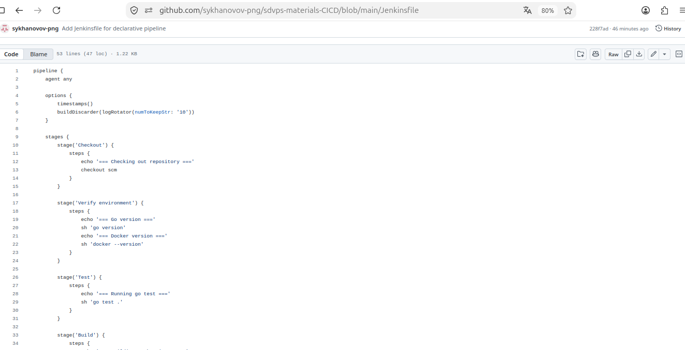
 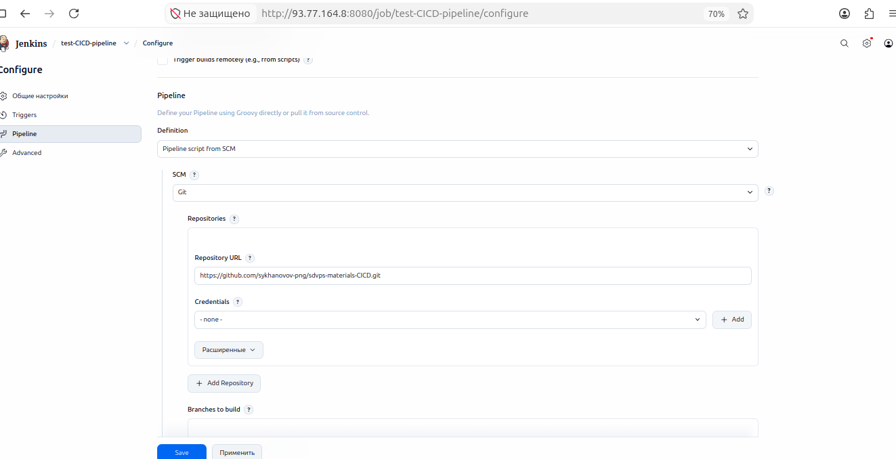
 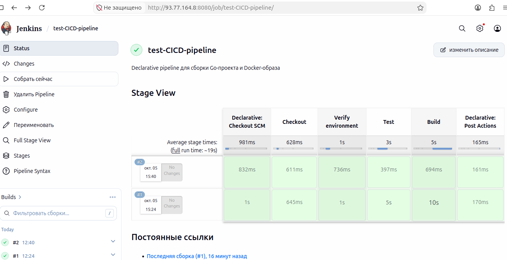
 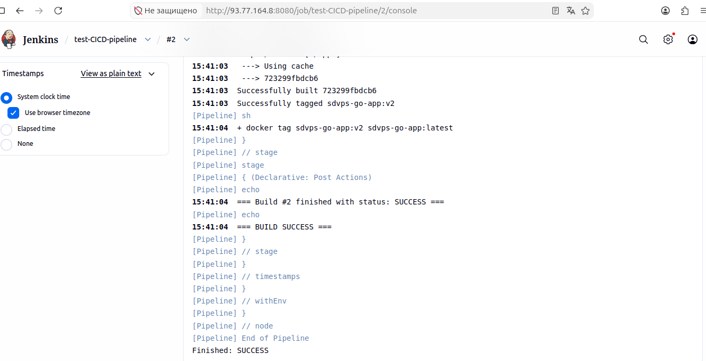
 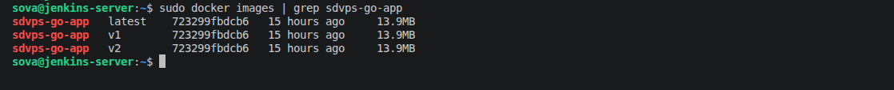


# Задание 3. Публикация Go-бинарника в Nexus

## Цель работы

Освоить установку Sonatype Nexus Repository Manager, создание
raw-hosted репозитория и публикацию бинарных артефактов из Jenkins
Pipeline в Nexus.

## Задание

1. Установить Nexus на машину с Jenkins.
2. Создать **raw-hosted** репозиторий.
3. Изменить pipeline так, чтобы вместо Docker-образа собирался
   **бинарный go-файл** (команда из Dockerfile).
4. Загрузить файл в репозиторий с помощью Jenkins.

## Используемое окружение

| Параметр | Значение |
|---|---|
| ВМ | `jenkins-server` (93.77.164.8) |
| Java | OpenJDK 21.0.7 |
| Jenkins | 2.580.1 |
| Go | 1.25.8 |
| Nexus | 3.96.4 (Community Edition) |
| RAM | 2 ГБ + 2 ГБ swap |

## Ход выполнения

### 1. Установка Nexus

Nexus 3.96.4 требует Java 21 — уже установлена для Jenkins.

```bash
sudo useradd -r -m -s /bin/bash -d /opt/nexus-data nexus

cd /tmp
sudo wget https://download.sonatype.com/nexus/3/nexus-3.96.4-01-linux-x86_64.tar.gz
sudo tar -xzf nexus-3.96.4-01-linux-x86_64.tar.gz -C /opt
sudo ln -s /opt/nexus-3.96.4-01 /opt/nexus

sudo mkdir -p /opt/nexus-data /opt/sonatype-work/nexus3/log /opt/sonatype-work/nexus3/tmp
sudo chown -R nexus:nexus /opt/nexus /opt/nexus-3.96.4-01 /opt/nexus-data /opt/sonatype-work
```

`/opt/nexus/bin/nexus.vmoptions`:

```
-Xms512m
-Xmx1024m
-XX:+UnlockDiagnosticVMOptions
-XX:+LogVMOutput
-XX:LogFile=../sonatype-work/nexus3/log/jvm.log
-XX:-OmitStackTraceInFastThrow
-Dkaraf.home=.
-Dkaraf.base=.
-Djava.util.logging.config.file=etc/spring/java.util.logging.properties
-Dkaraf.data=../sonatype-work/nexus3
-Dkaraf.log=../sonatype-work/nexus3/log
-Djava.io.tmpdir=../sonatype-work/nexus3/tmp
-Djdk.tls.ephemeralDHKeySize=2048
-Dfile.encoding=UTF-8
# ... блок --add-opens/--add-exports для Java 17+
```

`/etc/systemd/system/nexus.service`:

```ini
[Unit]
Description=Nexus Repository Manager
After=network.target

[Service]
Type=forking
LimitNOFILE=65536
ExecStart=/opt/nexus/bin/nexus start
ExecStop=/opt/nexus/bin/nexus stop
User=nexus
Group=nexus
Restart=on-failure
TimeoutSec=600
Environment="JAVA_HOME=/usr/lib/jvm/java-21-openjdk-amd64"

[Install]
WantedBy=multi-user.target
```

Запуск:

```bash
sudo systemctl daemon-reload
sudo systemctl enable nexus
sudo systemctl start nexus
```

Добавлен swap 2 ГБ для предотвращения OOM при совместной работе
Jenkins и Nexus:

```bash
sudo fallocate -l 2G /swapfile
sudo chmod 600 /swapfile
sudo mkswap /swapfile
sudo swapon /swapfile
echo '/swapfile none swap sw 0 0' | sudo tee -a /etc/fstab
```

### 2. Первичная настройка Nexus

- Веб: `http://93.77.164.8:8081`
- Логин `admin`, начальный пароль:
  ```bash
  sudo cat /opt/sonatype-work/nexus3/admin.password
  ```
- Пароль сменён при первом входе.

### 3. Создание raw-hosted репозитория

1. **Administration → Repository → Repositories → Create repository**
2. Рецепт **raw (hosted)**
3. Параметры:
   - **Name**: `sdvps-raw`
   - **Online**: ✅
   - **Blob store**: `default`
   - **Strict Content Type Validation**: ❌ (снята)
   - **Deployment policy**: `Allow redeploy`

URL: `http://93.77.164.8:8081/repository/sdvps-raw/`

### 4. Настройка credentials

Параметры Nexus заданы через **Manage Jenkins → System → Global
properties → Environment variables**:

| Name | Value |
|---|---|
| `NEXUS_URL` | `http://93.77.164.8:8081` |
| `NEXUS_USER` | `admin` |
| `NEXUS_PASS` | (пароль от Nexus) |

> При попытке использовать плагин **Credentials Binding**
> (`credentials('nexus-admin')`) пароль не передавался корректно —
> Nexus отвечал `401 Unauthorized`. Поэтому применён способ с
> **Global Environment Variables** — функционально эквивалентен.

### 5. Изменение Jenkinsfile

```groovy
pipeline {
    agent any

    options {
        timestamps()
        buildDiscarder(logRotator(numToKeepStr: '10'))
    }

    stages {
        stage('Checkout') {
            steps {
                echo '=== Checking out repository ==='
                checkout scm
            }
        }

        stage('Verify environment') {
            steps {
                echo '=== Go version ==='
                sh 'go version'
            }
        }

        stage('Test') {
            steps {
                echo '=== Running go test ==='
                sh 'go test .'
            }
        }

        stage('Build binary') {
            steps {
                echo '=== Building Go binary ==='
                sh '''
                    set -e
                    CGO_ENABLED=0 GOOS=linux go build -a -installsuffix nocgo -o sdvps-app .
                    ls -lh sdvps-app
                '''
            }
        }

        stage('Upload to Nexus') {
            steps {
                echo '=== Uploading binary to Nexus ==='
                sh '''
                    set -e
                    set +x
                    HTTP_CODE=$(curl -s -o /dev/null -w "%{http_code}" \
                        -u "${NEXUS_USER}:${NEXUS_PASS}" \
                        --upload-file sdvps-app \
                        "${NEXUS_URL}/repository/sdvps-raw/sdvps-app-v${BUILD_NUMBER}")
                    echo "=== Nexus response: HTTP $HTTP_CODE ==="
                    if [ "$HTTP_CODE" != "201" ]; then
                        echo "=== Upload failed! ==="
                        exit 1
                    fi
                    echo "=== Upload OK: sdvps-app-v${BUILD_NUMBER} ==="
                '''
            }
        }
    }

    post {
        success { echo '=== BUILD SUCCESS ===' }
        failure { echo '=== BUILD FAILED ===' }
        always {
            echo "=== Build #${BUILD_NUMBER} finished with status: ${currentBuild.currentResult} ==="
        }
    }
}
```

**Команда сборки** скопирована из Dockerfile:

```
CGO_ENABLED=0 GOOS=linux go build -a -installsuffix nocgo -o /app .
```

В Jenkinsfile путь вывода изменён на `-o sdvps-app`.

**Особенности этапа `Upload to Nexus`:**

- `set +x` — скрывает пароль из лога
- `curl -s -o /dev/null -w "%{http_code}"` — тихий режим, выводит только HTTP-код
- `-f` не нужен, так как явно проверяем код через `if`
- При коде ≠ 201 — сборка падает с `exit 1`

### 6. Запуск сборки

Сборка **#15** — SUCCESS.

Console Output:

```
=== Building Go binary ===
-rwxr-xr-x 1 jenkins jenkins 2.3M ... sdvps-app
=== Uploading binary to Nexus ===
=== Nexus response: HTTP 201 ===
=== Upload OK: sdvps-app-v15 ===
=== Build #15 finished with status: SUCCESS ===
Finished: SUCCESS
```

### 7. Проверка артефакта

**В браузере:** Browse → sdvps-raw → `sdvps-app-v15`

Метаданные в Nexus:
- **Content type**: `application/x-executable`
- **File size**: `2.3 MB`
- **Uploader**: `admin`
- **Uploader's IP Address**: `93.77.164.8` (с ВМ Jenkins)

**В терминале:**

```bash
curl -s -u admin:<пароль> \
  http://93.77.164.8:8081/repository/sdvps-raw/sdvps-app-v15 \
  -o /tmp/sdvps-app

file /tmp/sdvps-app      # ELF 64-bit LSB executable
chmod +x /tmp/sdvps-app
/tmp/sdvps-app
```

## Скриншоты

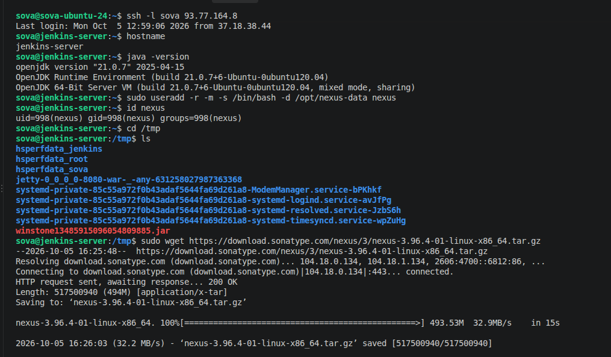

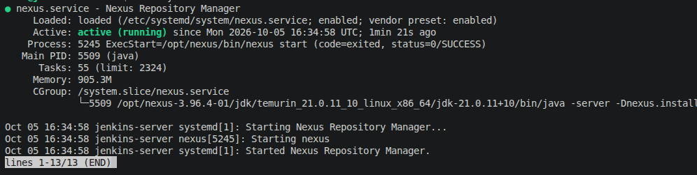
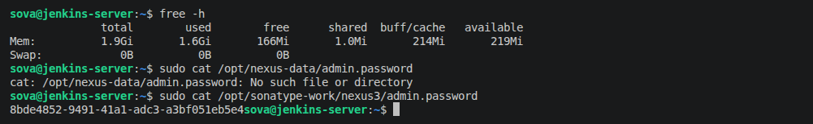
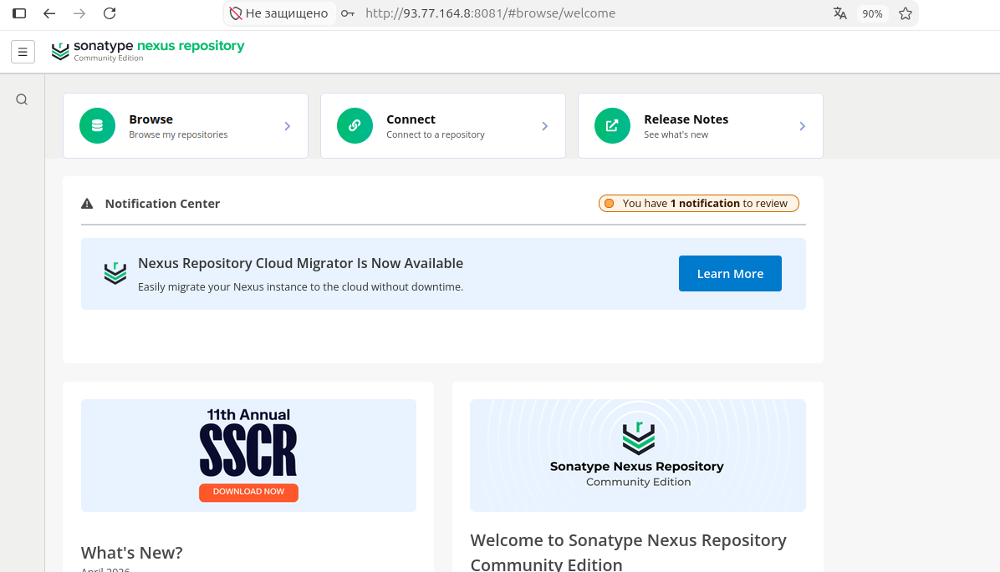
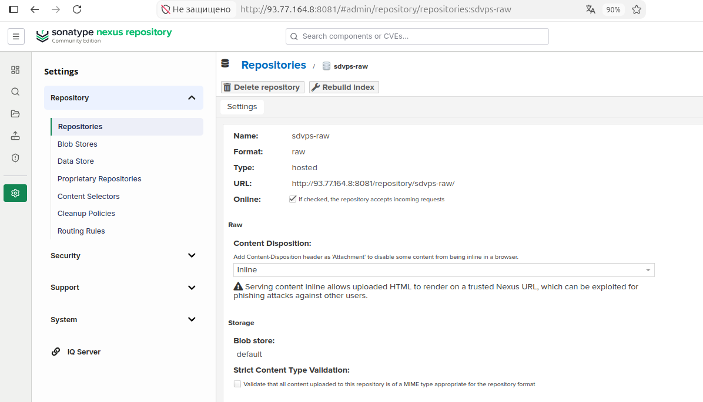
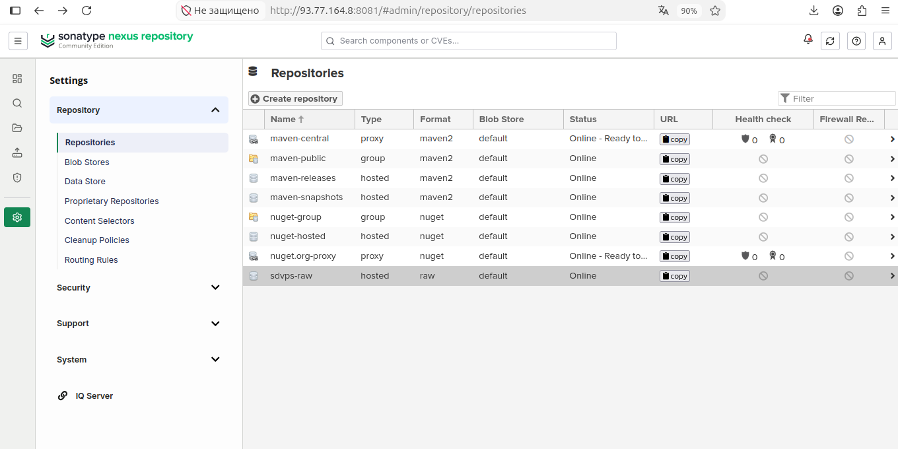
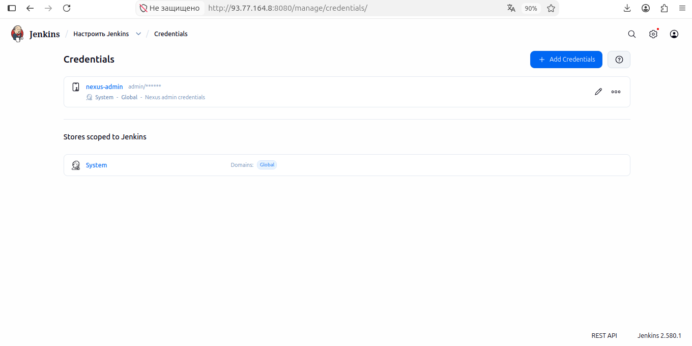
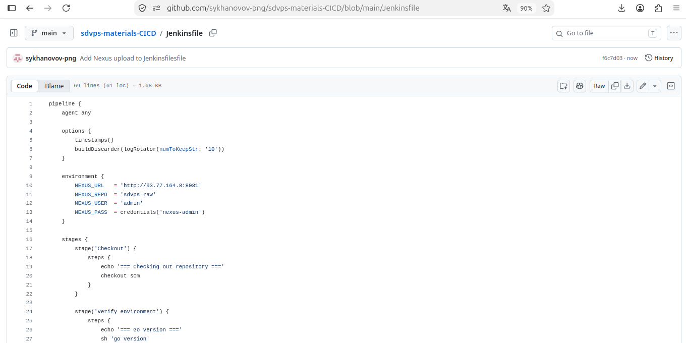
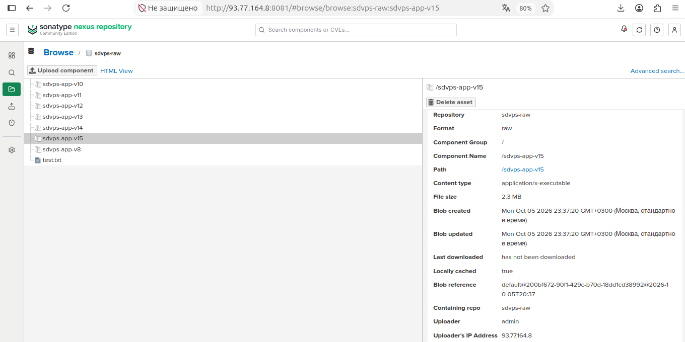
